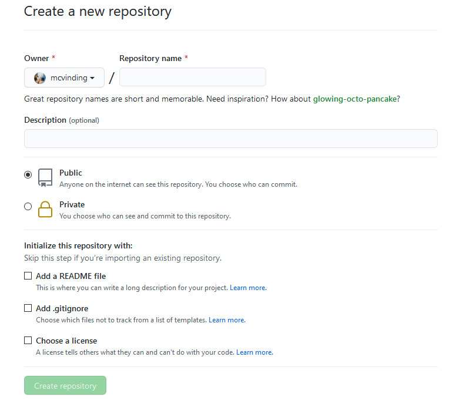
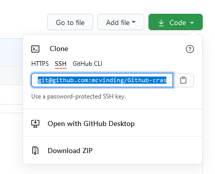
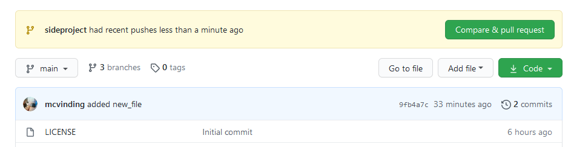
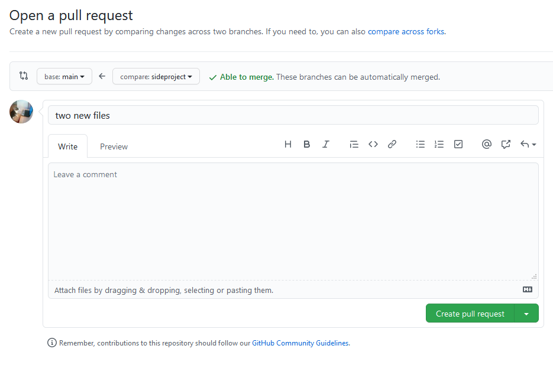
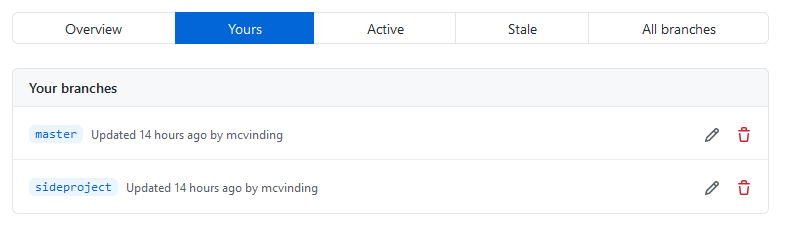
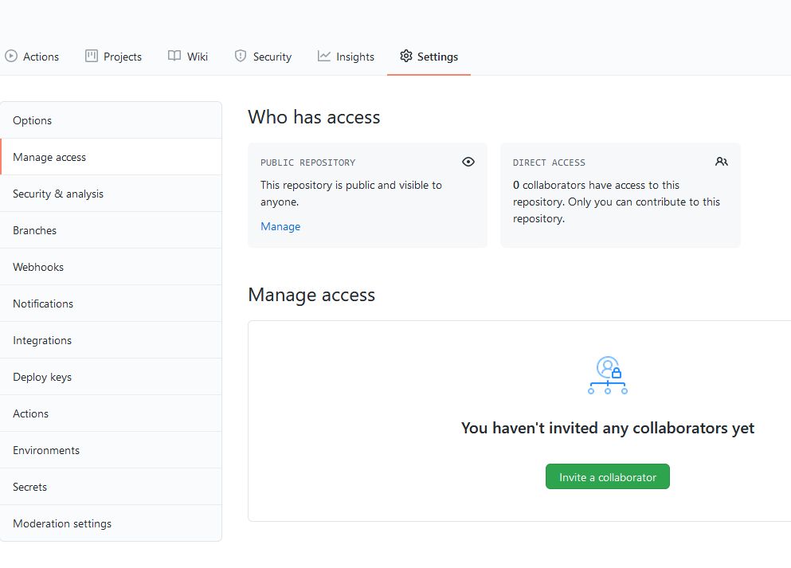

# Using Git/GitHub in Scientific Collaborations - tutorial
In this tutorial, you will use Git and GitHub to set up your own GitHub repository, add and remove files, and clone a remote repository (the one you are in right now) and synchronise it to your account. Finally, you can try to add each other as collaborators. 

If this is the first time you use Git it is a good idea to check that you have done the configuration. See the [setup guide](Setup_guide.md)

Note that code in `< >` brackets should be replaced with the text that applies you without the brackets. Everything else is copy/pate friendly.

## 1) Setup a repository
For the first exercise, you shall create a new repository with GitHub, initialise a local folder, set up the remote link between the GitHub folder and the local folder, and finally pull the remote folder.

*Step 1*: Go to your GitHub page. Click **Repositories** and then click the green **New** button. This will take you to the repository creation page. The repository that you are about to create will only be used for this tutorial (unless you want to keep using it for something else that is up to you), so it does not matter what you call it. As a general tip, try to keep the titles short and informative. I suggest that you call it `Github-crash-course`.

You then have the option to write a short description of the repository. This text is only for your GitHub page. It is nice to add one or two sentences that describe what this repository is for.



Then you have to select privacy settings for the repository. Your options are:

* **Public:** the repository is visible to anyone on the internet.
* **Private:** only you and any collaborator you add to the project can see the repository's content.

You can always change the privacy setting for the repository later in the settings menu once you are done with it's creation.

You then have the options to create the repository with some files already present. **README.md** will create the README file that is shown on the front page. **.gitignore** is a text file in which you can specify files in your folder that should not be tracked by Git once you start committing files. **Licence** lets you choose from among different open source licences. You can choose what you want, but you can also add these later.

For not create the repository with only a README file.

Spend a few minutes to click around on the different menus in your newly created repository to what you can do. See if you can find the place where you add collaborators?

*Step 2*: Initialise the local folder: go to the file path where you want the project to be saved on your local computer. Create a folder for the tutorial; call it, e.g., `Github-crash-course`. Make sure that you always have a folder dedicated to your new project. Do not initialise Git directly in your `home` directory.

Open the new folder in a terminal. On Windows, you can open the folder, right-click anywhere, and open **Git Bash here**. A terminal window will appear. Type

````bash
git init
````

The folder is not declared a git folder.

*Step 3*: Next, you should set up the remote. Find the link for the repository on the GitHub page.



Copy the link address. Then back in the terminal, you write

````bash
git remote add origin <the link>
````

You can check which remotes you have set up for the repository with this command:

````bash
git remote -v
````

*Step 4*: With the remote setup, the last step is to pull the remote files.

````bash
git pull origin main
````

You should now see the README file in your local repository.

> *Tip*: you can also run `git init` in folders that already have files in them, e.g., if you have a project you are working on that you want to upload to GitHub. The procedure is the same. You can then add the existing files, as you shall see in the next step.

## 2) Synchronize files
With the project setup, you are ready to work on your scripts in the folder. Working on your code is no different than before; Git has no impact on this. In case you are working on a project on different computers or working in collaboration, it is always good to start by pulling the latest changes as you did above with `git pull`. In case you are working on the project alone, you will know best yourself when and where you made the latest changes (unless you are like me and forget). Then do your work on the scripts. When you are done, you *stage* the files you want to *commit*.

Make a new text document in the project folder. Add some text to the document. If you do not know what to write, list your top ten favourite animals.

> *Tip*: terminal-based programs, including Git, can have trouble dealing with files with blank spaces in the filename. Use underscores instead, instead of `My File.txt`, call it `myFile.txt` or `My_File.txt`.
>
> Also note that *EVERYTHING* is case sensitive.

*Step 1:* Add your changes to the stage. Adding or removing files to the stage does not change the files or upload them right away. You can freely add and remove files at this point. It is not until you commit that the changes are made. Remember that the stage is like a box where you can put and take as many items in and out as you want. But when you commit, you seal the box and send it by post.

Add the file to the stage:

````bash
git add <my_file.txt>
````

Check the status of the stage to see what is changed since the last commit:

````bash
git status
````
You should see the filename in green under *changes to be committed*.

Next, edit the README file, e.g., describe what you wrote in the text file (ten favourite animals). Check the status again. You should see the filename of the README file is in red under *Changes not staged for commit*. These are files that are tracked by Git and have been changed but not staged yet. You can stage all changes with `git add -u` (for add all *U*n-staged changes).

Any files and folders in white at the bottom are not tracked by git, and it will not know if they are changed or not. you first need to add them with `git add <filename>`

*Step 2*: Commit the changes. Check the status. If the files and changes in the staging area are like you want them, you are ready to commit. Remember to write a useful commit message after the flag `-m` (for message). Begin and end with `" "`. In case you do not specify the `-m` flag, it will open the default terminal text editor (in most cases Vim) to remind you to write the commit message gently! It is easier to use the `-m` flag.

````bash
git commit -m "list of ten favorite animals"
````

*Step 3*. Now push the commit to the remote:

````bash
git push origin main
````

Go to the repository on your GitHub page (refresh if you already have it open). You should now see your new folder. If you do, then congratulations. You now know how to push/pull files.

Now try to remove the file you just created. Go back to the terminal. Use `git rm` to remove files:

````bash
git rm <my_file.txt>
````

Look in your folder again. The file is now gone! `git rm` deletes files permanently with no warning. Too bad if you wanted to keep that file or removed it by mistake. In case you want to keep the file, use the extra flag `--chached` with like this:

````bash
git rm <my_file.txt> --chached
````

This would have been useful to know before you were told to delete the file! Now, do you dare to add all changes (`git add -u`) and commit the changes before you go to the next step?


## 3) Revert to an earlier version
Let's see if we can restore the deleted file? Since you have not committed the changes yet, you can go back to the latest commit

````bash
$ git reset --hard HEAD
````

Did this restore the deleted file? If you committed the changes after deleting the file, it would be part of the latest commit. In that case, you must find a previous commit to revert to. First, you must find the commit id number of the commit. Use `git log` to get a list of all commits. You will see that each commit has a long gibberish number like this: `9fb4a...`. Copy the number of the commit you want to return to and use it like this:

````bash
$ git reset <the long number>
````

Check that you selected the right commit. It can be useful to go back to your GitHub repository to get an overview of the changes in the various commits if you have many commits.

## 4) Get remote project

You do not have to start a project from scratch every time. In the next part, you shall pull the scripts that are in this tutorial. The easiest way to do this is by using the one-way `clone` option. Find the link for the remote repository and then clone it. This will pull the entire repository into a new folder called `Github-crash-course`.

````bash
git clone <remote url>
````

This is how you (usually) would get open-source toolboxes. You can then keep the toolbox up to date by pulling the developers' recent updates whenever they push the latest changes. You can, however, not push your changes directly back unless they make you a collaborator. What you can do is to make your own "fork" of the repository. Let's look at two ways to do this.

*Option 1*: Clone the remote folder. Then change the remote `origin` to the address for your GitHub repository:

````bash
git remote set-url origin <the link>
````

Use `git remote -v` to see the location before and after you redefine `origin`. This option might lead to errors if you already have local changes.

*Option 2*: have multiple remotes. You can have multiple remotes beside `origin`. `origin` is not a Git function but the name we gave the remote when we defined it with `git remote add` (however, naming your main remote `origin` is the convention you will see all over GitHub, so use this name to make things easier for yourself and everybody else).

In the tutorial folder you created in the beginning, you specified `origin` as the GitHub repository on your account. Now add a new remote that point to this tutorial repository. As when you cloned the tutorial repository, find and copy the URL. Then add this as a new remote in your terminal. By convention, we call this `upstream`.

````bash
git remote add upstream <the link>
````

See the remotes with `git remote -v`. Get the files from the remote to your local folder and merge them into your `main` branch.

````bash
git fetch upstream main
git merge upstream/main
````

What you just is that you fetched the upstream folder as a separate branch and then merged that branch into your main branch.

## 5) Working with branches

So far, you have only been working on one branch. Let's say that you want to implement a new analysis step, but you do not yet want it to be part of the code you present on your GitHub account. A solution is to create a new branch. You can see your current branches with `git branch -a`. The main function to managing branches is `git checkout`. 
Create a new branch by adding the flag `-b` (for new *b*ranch) like this:

````bash
git checkout -b <branch name>
````
Keep the branch name short, informative, and without blank spaced; e.g., `bugfix` or `new-prepoc` depending on your reason for the new branch.

You can switch between branches with `git checkout` (without the `-b` flag).

````bash
git checkout <branch name>
````

If you get lost, use git `git branch -a` or `git branch -v` to see your branches with the one you are currently on highlighted. The output from `git status` also specify as the first line which branch you are currently at and what changes you have in that branch.

Make it a practice to always check which branch you are in when you begin your work.

**Working on a new branch**

Now switch back to the new branch. If you merged, the remote should have the folder called `friday_toolbox`. The folder contains a single MATLAB/Octave file with a function. You can try and run the script if you have MATLAB or Octave (if not, it is just a text file, and you can open and edit it with any text editor). In short, the function finds today's day and return the answer depending on the date.

Now let's say you want to expand the function to take any date as input. See if you can make it work with the following code snippets. Define the input as `varargin` (default MATLAB for any input).

````Matlab
if ~isempty(varargin)
     day = varargin(1);
else                                    % This part is already in the script
    format shortg
    D = clock;
    day = [num2str(D(1)),'-',num2str(D(2)),'-',num2str(D(3))];
end
````

When you are done, add the changes to the stage, commit, and push. Note that you are no longer on the `main` branch when you push the changes. When you push, you should therefore not push to `main` but the current branch

````bash
git push origin <branch name>
````

You can also see the branches that you have pushed to your GitHub repository on the repository page with the branch drop-down menu. You can use the drop-down menu to switch between branches on the GitHub repository in the same way that you switch between branches locally with `git checkout`. 

**Merging branches**

As a general rule, you do not want too many branches. When you are done with the work that made you create the new branch, you should merge it into your main branch.

*Option 1*: Merging in the GitHub repository. When you looked the GitHub repository, you might have seen a message about the newly pushed branch?



When you bushed the new branch, GitHub automatically created a pull request, i.e., asking you to merge the new branch into `main`. Click the green button **Compare & pull request**. This will take you to a new page where you can finalise the merge. First, GitHub will tell if there are any conflicts between the branches that you have to sort out first (i.e., if there are multiple changes to the same files independent of one another).



If there are no conflicts, you should write a short comment (similar to the commit messages) and optional a more extended explanation to let your collaborators know what you did.

If you scroll further down, you will see an overview of the changes that will be merged. Click **Create pull request** to finalise the merge.

Since the branch is now merged into `main` at the remote repository, you can get the merged files by pulling the `origin main` as usual.

*Option 2*: Merge in your local folder. In case you do not want to push your new branch to your remote GitHub repository, you can also merge the branches locally. First, use `git checkout` to switch to the branch that you want to merge into. Then use `git merge` to merge the other branch.

````bash
git checkout main
git merge <branch name>
````

Git will tell you if there are any conflicts that you need to sort out. If not, the `<branch name>` is merged into your `main` branch.

**Delete a branch**

When you are done merging, you can delete the branch to keep it simple and avoid suddenly having a lot of unused branches with changes you forgot about. 

Delete branch:

````bash
git branch -d <branch name>
````

Delete remote branches in your GitHub repository by clicking the branch drop-down menus and select **View all branches**. Then go to the overview of branches and click the garbage icon to delete the branch.



# 6) Collaborations

All of the above covers how to manage your project files. The next step is how to manage your collaborators. GitHub has many ways to define collaborations. The easiest and most straight forward way is to add your collaborators directly to the repository by giving them access. This is done at the repository level, so they will only have access to that repository and not anything else on your account.

First, you need to make sure that your collaborator has a GitHub account.

To grant your collaborator access, got to the **Settings** tab on the repository’s main page. Click **Manage access** in the menu on the left. Enter your password. This takes you to an overview of who has access to the repository.

Click the green **Invite a collaborator** button. 



A new window appears, where you can search for your collaborators GitHub username or email address. Click the green button to confirm.

If you are on the online crash course, go back to the meeting. You will be paired up with another attendee in a break-out room. Try to complete the following tasks:

1. Add each other as collaborators on each other’s tutorial GitHub repositories by giving access s described above.
2. Get their code into a local directory on your computer. You might want to create a new folder. Then set up a new remote (`git remote add`) that point to your partner's repository and pull their code. Give the new remote an informative name (e.g., their initials).
3. Add the text file from previously to their project. Commit and push the changes back to your partner's repository. This will create a pull request on their side, and their push will create a pull request on your side.
4. Merge each other’s pull request

Note that working with repositories that you do not own follows the exact same procedures as working on your own repositories. In practice, you would not be working on two different repositories in parallel unless they are two different projects. Keep one repository per project.

# Summary

Now you should know the basics for using Git and GitHub to manage your analysis scripts and collaborate. There is a lot more to learn and many features in Git and GitHub. Feel free to explore.

The next step for you is to set up a real GitHub repository for your real projects. You can create those from scratch as shown above: 
1. Create the repository on your GitHub page.
2. Initialise Git in your local folder. In case you already have a local folder with scripts but want to get started with Git, then also create a repository on your GitHub page (without any README file or anything); then initialise Git in the folder where you have your scripts.
3. Add all the scripts that you want to track and keep synchronised.

It is unavoidable that you run into errors at some points. Do not despair! Errors can be fixed. Try to go back to see what went wrong and seek out solutions online. Git and GitHub have a huge user base. Someone has likely run into the same error as you, posted about it somewhere, and found a solution.
